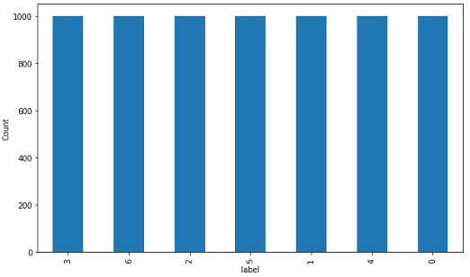
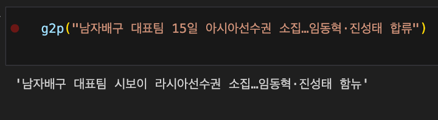
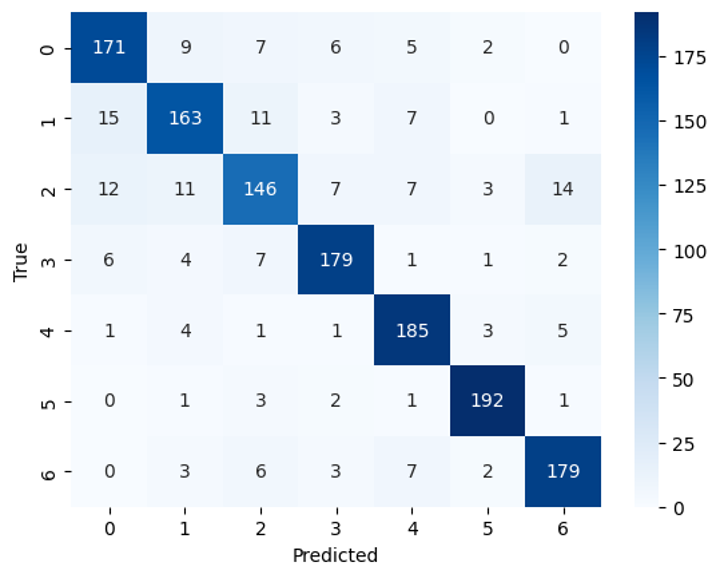

# Level 2 Data-centric AI - NLP 11조

## 프로젝트 개요
KLUE-주제 분류(Topic Classification) 과제를 수행하며 데이터 중심(Data-centric)의 접근법을 사용합니다. 주된 목표는 기존의 베이스라인 모델의 구조적 변경 없이 훈련 데이터의 조정과 최적화를 통해 모델의 성능을 향상시키는 것입니다. 

## 팀 구성 및 역할

이름|역할
|---|---|
박산야| Data Analysis, Data 전처리, Data 별 학습 결과 비교 후 성능 예측
박준우| Data 전처리, Data 증강
조병률| Data Analysis, G2P noise control, Label noise control
함문정| 데이터 전처리 및 증강 시도

## 데이터 분석

1. 라벨         
0.IT과학, 1.경제, 2.사회, 3.생활문화, 4.세계, 5.스포츠, 6.정치

2. 노이즈           
a.	텍스트 노이즈: G2P(Grapheme-to-Phoneme) 변환기를 사용하여 생성된 텍스트 노이즈로, 실제 텍스트 데이터에 음성 변환 과정을 통해 인위적인 오류가 섞여 있습니다.         
b.	라벨 노이즈: 데이터 포인트의 라벨을 임의로 변경하여 생성된 노이즈입니다         
3.Baseline model 취약점 분석            

